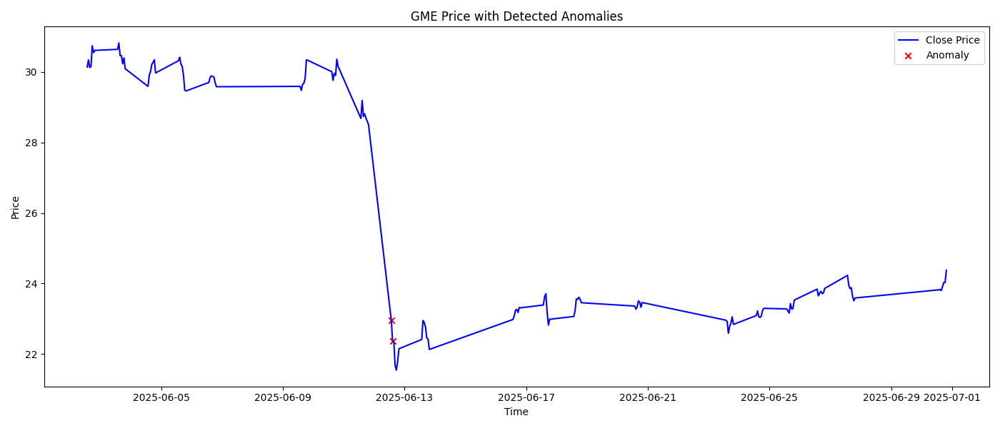
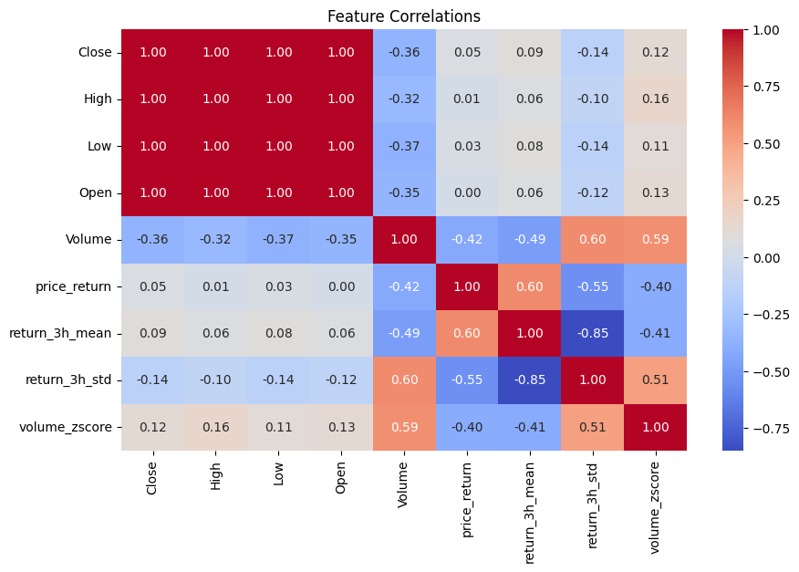
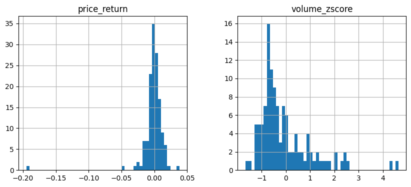

# Market Anomaly Detector

Detect suspicious market movements using Reddit, Twitter, and price data — powered by Machine Learning.

Live App: https://market-anomaly-tp.streamlit.app

---

## Project Overview

This project builds an end-to-end pipeline to detect potential stock market manipulation using:

- Real-time social media data (Reddit and Twitter)
- Hourly financial data
- Anomaly detection with Isolation Forest

---

### What is Market Manipulation?

Imagine you're playing a game where the price of a toy depends on how many people want it. Now, someone spreads fake news saying the toy will be banned. Everyone panics and starts selling the toy, and its price drops. This is market manipulation — using tricks to make prices go up or down unfairly.

### What is Anomaly Detection?

If your friend brings the same lunch every day, but one day brings a giant pizza, you’d notice that as something strange or different — an anomaly. In this project, our model tries to spot those strange events in the stock market.

### Why Use Reddit and Twitter?

Social media often influences stock prices. We collect posts and tweets about a stock to detect sudden changes in public interest or hype, which might indicate manipulation.

---

## How It Works

1. **Data Collection**
   - `collect_twitter.py`: Uses Twitter API to fetch tweets.
   - `collect_reddit.py`: Uses Reddit API to fetch posts.

2. **Preprocessing**
   - Cleans and merges data, aligns timestamps, calculates returns.

3. **Feature Engineering**
   - Moving averages, standard deviations, volume z-score, etc.

4. **Model Training**
   - Isolation Forest is trained on market data.
   - Detects anomalies where data deviates from learned patterns.

5. **Visualization**
   - Streamlit dashboard for interactive exploration and output download.

---

## 🖼️ Visual Insights

### 📍 GME Anomalies  


### 🔥 Feature Correlations (Heatmap)  


### 📊 Volume Z-Score Trend  


---

## Model Details

- Model: Isolation Forest
- Input: Market features (price return, volume z-score, moving averages)
- Output: -1 for anomaly, 1 for normal behavior
- Training Size: Approximately 140 rows of hourly data (can be scaled)

---

## Environment Variables (.env)

REDDIT_CLIENT_ID=your_id  
REDDIT_CLIENT_SECRET=your_secret  
REDDIT_USER_AGENT=MarketManipDetector/0.1 by yourusername  
TWITTER_BEARER_TOKEN=your_bearer_token  

---

## Setup Locally

```bash
git clone https://github.com/your-username/market-anomaly-detector.git
cd market-anomaly-detector
pip install -r requirements.txt
streamlit run app.py
```
